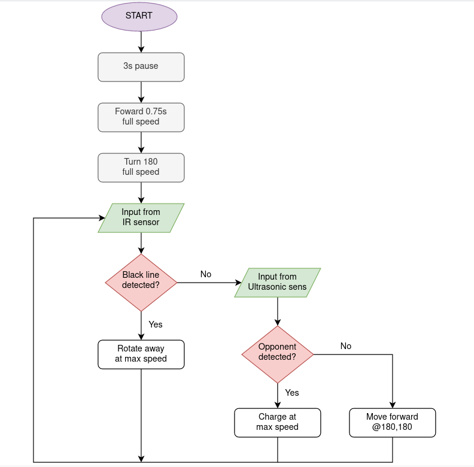

# sumo-bot

## Team Name
### YouTube Link 
We were planning to go with https://youtu.be/dQw4w9WgXcQ, but the cher too lazy to write and called us by this name instead

## Team Members
Ryan, Harish and I

## Context
* An Ardunio Uno project done in 2020 for EDS module
* Our team won 4th place in the sumo bot intra class compeition.

## Flowchart

